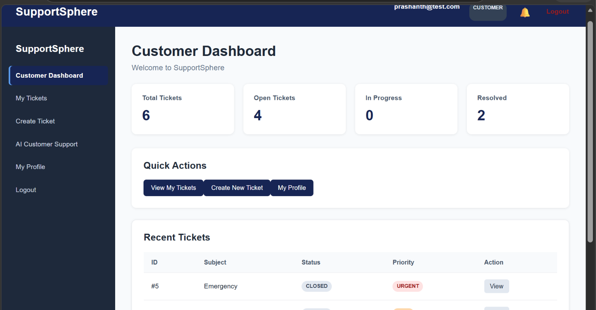
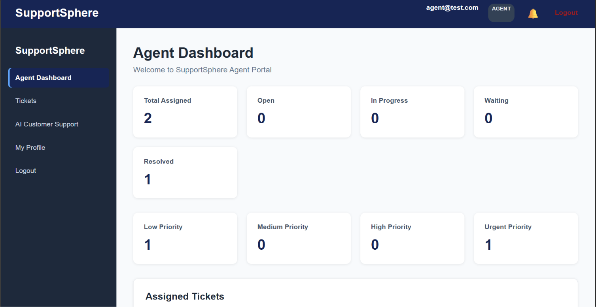
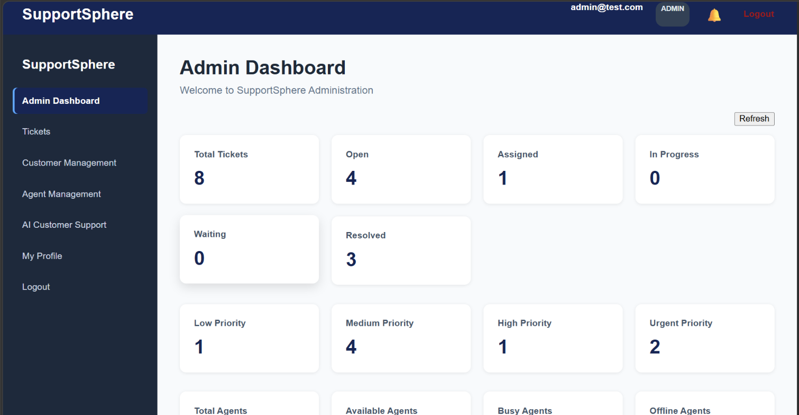
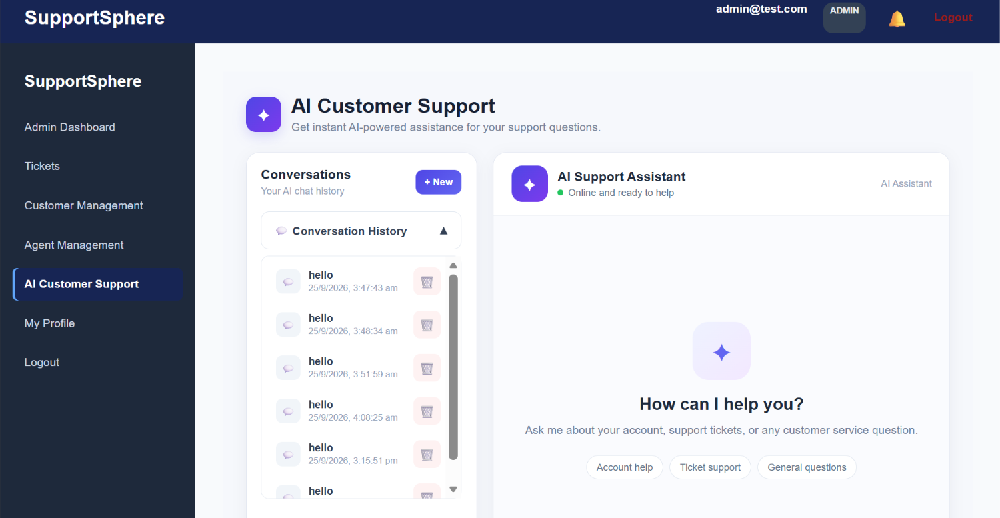

# SupportSphere — AI Customer Support & CRM

SupportSphere is a full-stack **AI-powered Customer Support and CRM application** built with Java, Spring Boot, React, MySQL, and Docker.

It provides role-based customer support workflows for **Customers, Agents, and Administrators**, together with ticket management, conversations, attachments, notifications, feedback, AI-powered customer assistance, and a knowledge-base/RAG layer.

---

## Features

### Customer

* Register and login
* Secure JWT authentication
* Customer dashboard
* Create and manage support tickets
* View ticket status and priority
* Communicate with support agents
* Upload and access attachments
* Submit feedback and ratings
* View notifications
* Manage profile
* AI customer support chat
* View previous AI conversations

### Agent

* Secure agent login
* Agent dashboard
* View assigned tickets
* Update ticket status and priority
* Reply to customers
* Manage ticket conversations
* Access permitted attachments
* Manage agent availability

### Administrator

* Admin dashboard
* Manage customers
* Manage agents
* Create and manage agents
* View and manage tickets
* Assign tickets to agents
* Manage ticket status and priority
* Delete tickets when authorized
* Access administrative management features

### AI Customer Support

* AI chat interface
* Persistent AI conversations
* Persistent AI messages
* Conversation history
* Create new conversations
* Delete conversations
* Retry failed AI messages
* Loading and error states
* Ticket-aware AI responses
* Customer-specific conversation security
* Protection of internal ticket messages

### Knowledge Base / RAG

* Knowledge documents
* Knowledge chunks
* Retrieval-based AI support
* Company knowledge integration with AI

---

## Technology Stack

### Backend

* Java 17
* Spring Boot
* Spring Security
* Spring Data JPA
* REST APIs
* JWT Authentication
* BCrypt Password Hashing
* Maven

### Frontend

* React
* Vite
* React Router
* JavaScript
* HTML/CSS

### Database

* MySQL 8

### AI

* External AI/LLM API integration
* AI conversation and message persistence
* Ticket-aware AI context
* RAG knowledge-base functionality

### Deployment & DevOps

* Docker
* Docker Compose
* Nginx
* AWS deployment preparation

---

## Architecture

```text
                    ┌──────────────────────┐
                    │      React + Vite    │
                    │   Customer / Agent   │
                    │       / Admin        │
                    └──────────┬───────────┘
                               │
                               │ REST API
                               ▼
                    ┌──────────────────────┐
                    │    Spring Boot API   │
                    │                      │
                    │ Security             │
                    │ Controllers          │
                    │ Services             │
                    │ Repositories         │
                    │ AI Services          │
                    └──────────┬───────────┘
                               │
                 ┌─────────────┴─────────────┐
                 │                           │
                 ▼                           ▼
       ┌──────────────────┐        ┌──────────────────┐
       │     MySQL 8      │        │    AI / LLM API  │
       │                  │        │                  │
       │ Users            │        │ AI responses     │
       │ Tickets          │        │ AI assistance    │
       │ Messages         │        └──────────────────┘
       │ AI Conversations │
       │ Knowledge Data   │
       └──────────────────┘
```

---

## Security

SupportSphere uses multiple security mechanisms:

* JWT-based authentication
* Role-based authorization
* ADMIN / AGENT / CUSTOMER roles
* BCrypt password hashing
* Protected REST endpoints
* Customer-specific ticket authorization
* Agent assigned-ticket authorization
* Protected AI conversations
* Protected AI messages
* Authenticated attachment access
* CORS configuration
* Security headers
* Environment-based secrets
* Request validation
* File upload restrictions
* Database schema controlled through configuration

Secrets such as database passwords, JWT secrets, and AI API keys are supplied through environment variables rather than committed to GitHub.

---

## AI Architecture

The AI support flow is:

```text
React AI Chat
      │
      ▼
Spring Boot AI API
      │
      ▼
AI Service
      │
      ├── Customer context
      ├── Ticket context
      ├── Conversation history
      └── Knowledge context
      │
      ▼
AI / LLM Provider
      │
      ▼
AI Response
      │
      ▼
Database
      │
      ▼
React AI Chat
```

The AI functionality was developed incrementally, including conversation storage, message storage, conversation history, ticket-aware context, error handling, retry functionality, and user-specific security.

---

## RAG Knowledge Base

SupportSphere extends the AI system with a knowledge-base layer.

```text
Knowledge Documents
        │
        ▼
Knowledge Chunks
        │
        ▼
Retrieval
        │
        ▼
Relevant Knowledge
        │
        ▼
AI / LLM
        │
        ▼
Context-aware Response
```

This allows the AI functionality to use stored application/company knowledge instead of relying only on a general AI model.

---

## Docker Architecture

The Dockerized application runs as three main services:

```text
Browser
   │
   ▼
React + Nginx
localhost:5173
   │
   ▼
Spring Boot
localhost:8081
   │
   ▼
MySQL 8
Docker container :3306
```

Docker services:

```text
supportsphere-frontend
supportsphere-backend
supportsphere-mysql
```

Docker Compose is used to manage the application services and MySQL persistent storage.

---

## Backend Structure

```text
src/
└── main/
    ├── java/
    │   └── com/supportsphere/
    │       ├── config/
    │       ├── controller/
    │       ├── entity/
    │       ├── exception/
    │       ├── repository/
    │       ├── security/
    │       └── service/
    │
    └── resources/
        ├── application.properties
        └── application-prod.properties
```

The backend follows a layered architecture:

```text
Controller
    ↓
Service
    ↓
Repository
    ↓
MySQL
```

---

## Frontend Structure

```text
src/
├── components/
├── context/
├── pages/
├── services/
└── App.jsx
```

The frontend contains separate workflows for:

```text
Customer
Agent
Admin
AI Customer Support
```

Protected routes and authentication context are used to control access to application features.

---

## Main Domain Areas

SupportSphere contains entities covering:

* Users
* Roles
* Customers
* Agents
* Categories
* Tickets
* Ticket Messages
* Attachments
* Knowledge Documents
* Knowledge Chunks
* AI Conversations
* AI Messages
* Feedback
* Notifications

---

## Environment Variables

Create a local `.env` file for Docker configuration.

Example:

```env
DB_URL=jdbc:mysql://mysql:3306/support_sphere
DB_USERNAME=root
DB_PASSWORD=your_database_password

AI_API_KEY=your_ai_api_key

JWT_SECRET=your_secure_jwt_secret
```

**Never commit `.env` to GitHub.**

The repository uses `.gitignore` to prevent environment files and other local/development data from being committed.

---

## Running Locally

### Backend

From the backend project:

```bash
mvn spring-boot:run
```

The development backend runs on:

```text
http://localhost:8080
```

### Frontend

From the React project:

```bash
npm install
npm run dev
```

The development frontend runs through the Vite development server.

---

## Running with Docker

Build the backend image:

```bash
docker build -t supportsphere-backend:latest .
```

Build the frontend image:

```bash
docker build -t supportsphere-frontend:latest .
```

Start the complete application:

```bash
docker compose up -d
```

Check running containers:

```bash
docker ps
```

Stop the application:

```bash
docker compose down
```

---

## Docker URLs

When running the Dockerized application:

| Component       | URL                     |
| --------------- | ----------------------- |
| React + Nginx   | `http://localhost:5173` |
| Spring Boot API | `http://localhost:8081` |
| MySQL           | Docker internal network |

---

## 🔌 API Areas

The backend exposes REST APIs for major application modules including:

```text
/api/users
/api/customers
/api/agents
/api/categories
/api/tickets
/api/messages
/api/ai
```

Authentication and authorization are applied according to the user's role and the resource being accessed.

---

## Core Support Workflow

```text
Customer
   │
   ├── Creates Ticket
   │
   ▼
Ticket
   │
   ▼
Admin Assigns Agent
   │
   ▼
Agent Handles Ticket
   │
   ├── Messages
   ├── Status
   ├── Priority
   └── Attachments
   │
   ▼
Customer Receives Support
   │
   ▼
Feedback / Rating
```

AI support provides an additional path:

```text
Customer
   │
   ▼
AI Customer Support
   │
   ├── Conversation History
   ├── Ticket Context
   └── Knowledge Base
   │
   ▼
AI Response
```

---

## AWS Preparation

The project has also been prepared conceptually for AWS deployment.

The Dockerized architecture allows the application components to be moved toward cloud deployment without changing the core application architecture.

AWS deployment can later include:

```text
React / Nginx
      │
      ▼
AWS Compute
      │
      ├── Spring Boot
      │
      ▼
Managed MySQL Database
      │
      ▼
AI Provider
```

AWS resources can be configured when actual deployment is required.

---

## Screenshots



### Agent Dashboard



### Admin Dashboard



### AI Customer Support


```

## Developer

**Sai Prashanth**

Java Full Stack Developer | Spring Boot | React | MySQL | AI

GitHub: `praSHAnTH630490`

---

## License

This project is currently maintained as a personal portfolio and learning project.
